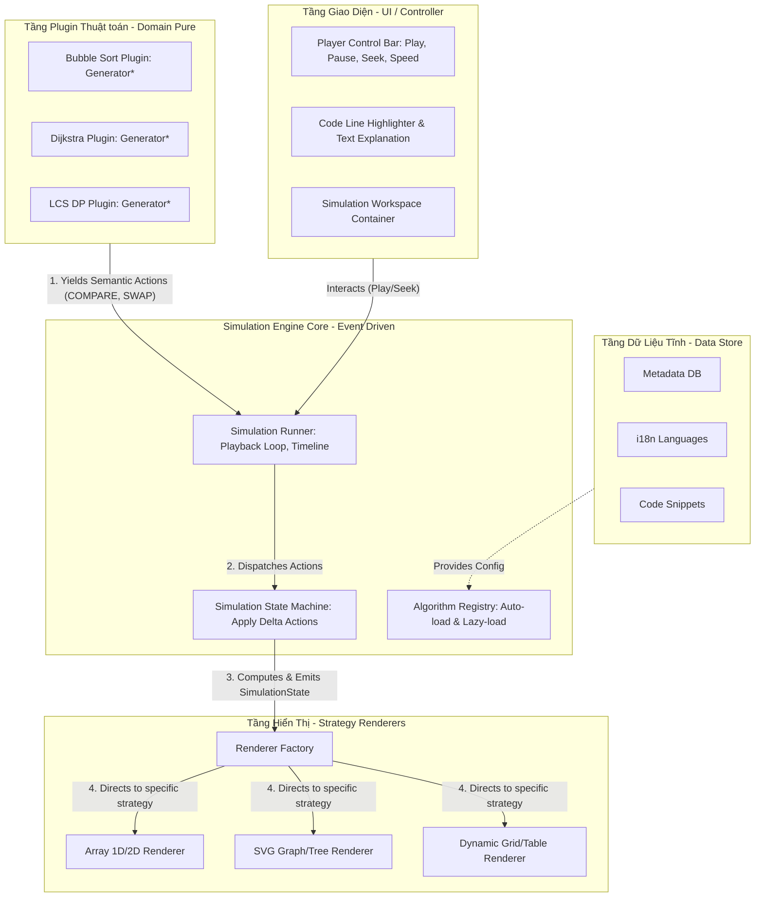
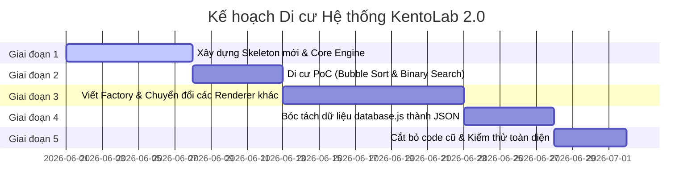

# KENTO LAB 2.0: KIẾN TRÚC HỆ THỐNG MÔ PHỎNG THUẬT TOÁN (PRODUCTION-LEVEL)
*Tài liệu kế hoạch & thiết kế chi tiết bởi Senior Software Architect & Frontend Engineer*

---

## 1. Vấn đề của architecture hiện tại

Dựa trên việc kiểm tra chi tiết mã nguồn hiện tại trong `database.js` và `execution.js`, hệ thống đang vận hành dưới dạng một cấu trúc **Monolith nguyên khối** sơ khai. Cấu trúc này chứa đựng những rủi ro lớn (Technical Debt) và các thiết kế phản mẫu (Anti-patterns) ngăn cản việc mở rộng quy mô.

### 1.1. Các Anti-patterns & Technical Debts nổi cộm
*   **God Files (Tập tin vạn năng):** 
    *   `database.js` (~887 dòng) gánh vác quá nhiều trách nhiệm: định nghĩa cấu trúc menu phân cấp (megaGroups, categories), lưu trữ dữ liệu đồ thị mẫu, và lưu trữ dữ liệu tĩnh cực lớn của toàn bộ thuật toán (mô tả, ý tưởng, độ phức tạp, mã giả, mã nguồn C++/Python...).
    *   `execution.js` (~746 dòng) chứa toàn bộ các generator (thực chất là hàm tạo danh sách) của tất cả thuật toán, trộn lẫn logic điều phối (dispatcher) và logic sinh bước.
*   **Eager Step Generation (Sinh bước trước - Eager Evaluation):**
    *   Thay vì sử dụng ES6 Generator thực thụ (`function*`), các hàm trong `execution.js` chạy từ đầu đến cuối thuật toán, gom toàn bộ các bước vào một mảng `steps` lớn rồi trả về một lần:
        ```javascript
        generator: function(arr) {
          let steps = [];
          // ... thực thi hết thuật toán và push vào steps ...
          return steps;
        }
        ```
    *   *Hệ quả:* Tốn dung lượng bộ nhớ (RAM) đột biến khi chạy mảng lớn hoặc thuật toán phức tạp (như Quy hoạch động ma trận, đồ thị nhiều đỉnh). Không thể xử lý các luồng mô phỏng vô tận hoặc dừng/ngắt dòng chạy giữa chừng một cách hiệu quả.
*   **Tight Coupling (Liên kết quá chặt giữa logic và hiển thị):**
    *   Mỗi bước mô phỏng được sinh ra đang quyết định trực tiếp giao diện hiển thị:
        ```javascript
        steps.push({ array: [...arr], highlights: { [i]: 'compare' }, line: 2, desc: `Kiểm tra...` })
        ```
    *   Trong đó, `'compare'`, `'match'`, `'skipped'`, `'pivot'`, `'sorted'` là các lớp CSS/giao diện hiển thị. Thuật toán buộc phải biết renderer sẽ hiển thị nó như thế nào. Nếu sau này muốn đổi CSS class hoặc đổi renderer sang canvas/SVG, ta sẽ phải sửa lại code logic của từng thuật toán.
*   **Data & Logic Mixing (Nhập nhằng dữ liệu và mã nguồn):**
    *   Phần text giải thích bước chạy bằng tiếng Việt (`desc: "Vì ... tiến hành hoán đổi..."`) bị hardcode trực tiếp trong file logic `execution.js`. Điều này khiến việc đa ngôn ngữ hóa (i18n) hệ thống trở nên bất khả thi.

### 1.2. Khó khăn trong quản lý & phát triển (Scalability & Maintainability)
*   **Regression Risks (Lỗi dây chuyền):** Khi 100+ thuật toán nằm chung file, việc thêm mới hoặc tối ưu hóa thuật toán A rất dễ làm hỏng thuật toán B do sơ suất về cú pháp hoặc biến dùng chung.
*   **Bế tắc khi mở rộng Visualization:** Hiện tại, dispatcher nhận diện hiển thị bằng cách gán `vType` thô sơ (`array`, `graph`, `console`, `dpTable`). Nếu muốn tạo một kiểu hiển thị mới (như Grid cho A* Pathfinding, Recursion Tree cho Đệ quy), hệ thống sẽ phải viết thêm hàng loạt cấu trúc `if-else` lồng nhau.
*   **Không có cơ chế "Lùi bước" (Step Backward) tối ưu:** Để lùi lại 1 bước, hệ thống hiện tại phải rollback về phần tử trước đó trong mảng `steps` đã lưu sẵn snapshot (ví dụ: clone lại mảng `array: [...temp]`). Với các cấu trúc dữ liệu phức tạp (như cây nhị phân lớn, mạng lưới đồ thị lớn), việc clone snapshot toàn bộ cấu trúc tại mỗi bước nhỏ là một thảm họa về bộ nhớ.

---

## 2. Architecture mới đề xuất

Kiến trúc mới hướng tới một hệ sinh thái **Plugin-driven** và **Event-driven**, áp dụng nguyên lý Clean Architecture để chia hệ thống thành các tầng độc lập:

### 2.1. Sơ đồ kiến trúc (Conceptual Architecture)



### 2.2. Chi tiết 4 tầng chức năng

1.  **Tầng Plugin Thuật Toán (Domain Layer):** 
    *   Nơi lưu trữ logic thuật toán dưới dạng các **Pure ES6 Generator Functions**.
    *   *Nhiệm vụ:* Chỉ thực hiện thuật toán toán học và `yield` ra các **Semantic Actions** (hành động mang tính ngữ nghĩa, ví dụ: "So sánh đỉnh A và B", "Cập nhật giá trị nút X").
    *   *Đặc điểm:* Hoàn toàn không biết về DOM, CSS, Canvas hay Renderer.
2.  **Simulation Engine Core (Application Layer):**
    *   Quản lý vòng đời mô phỏng (Play, Pause, Step Next, Step Back, Jump To, Speed).
    *   Chứa **State Machine (Reducer)** chịu trách nhiệm tích lũy các Action để tạo nên một `SimulationState` thống nhất.
    *   Quản lý **Algorithm Registry** hỗ trợ đăng ký plugin và nạp động (lazy loading) theo nhu cầu.
3.  **Strategy Renderers (Presentation Layer):**
    *   Nhận `SimulationState` từ Engine và vẽ lại (re-render) cấu trúc tương ứng lên DOM/Canvas/SVG.
    *   Áp dụng **Strategy Pattern**: Mỗi renderer đảm nhận một giao diện hiển thị chuyên biệt (Array, Graph, Tree, Matrix). Renderer hoàn toàn không biết thuật toán nào đang chạy, nó chỉ vẽ dựa trên trạng thái dữ liệu nhận được.
4.  **UI Controller (Infrastructure Layer):**
    *   Các component quản lý thanh điều khiển, tốc độ, khung hiển thị code, bảng thông tin học thuật.

---

## 3. Folder structure

Cấu trúc thư mục mới được tổ chức theo hướng Module-first (Feature-based), giúp các lập trình viên dễ dàng làm việc độc lập mà không đụng chạm mã nguồn của nhau.

```text
src/
├── core/                               # Lõi điều phối mô phỏng
│   ├── Engine.js                       # Lớp điều khiển chính (Play, Pause, Timeline)
│   ├── StateMachine.js                 # State Reducer tích lũy Action thành State
│   ├── Registry.js                     # Quản lý đăng ký thuật toán và lazy loading
│   └── Types.js                        # Định nghĩa kiểu dữ liệu (JSDoc hoặc TypeScript)
│
├── renderers/                          # Các lớp vẽ trực quan (Strategy Pattern)
│   ├── BaseRenderer.js                 # Lớp cơ sở (Abstract Class) cho mọi Renderer
│   ├── ArrayRenderer.js                # Vẽ mảng 1D, 2D (cột, khối hộp)
│   ├── GraphRenderer.js                # Vẽ đồ thị mạng lưới bằng Canvas/SVG
│   ├── TableRenderer.js                # Vẽ bảng Quy hoạch động (DP Grid)
│   ├── ConsoleRenderer.js              # Vẽ kết quả log/terminal giả lập
│   └── RendererFactory.js              # Khởi tạo Renderer tương ứng dựa trên vType
│
├── algorithms/                         # Kho plugin thuật toán cô lập
│   ├── sorting/                        # Nhóm thuật toán sắp xếp
│   │   ├── bubble/                     # Thuật toán Bubble Sort cụ thể
│   │   │   ├── metadata.json           # ID, độ phức tạp, phân mục thuật toán
│   │   │   ├── generator.js            # Pure generator logic (yield actions)
│   │   │   ├── pseudocode.json         # Mã giả (các thứ tiếng)
│   │   │   └── snippets/               # Mã nguồn đa ngôn ngữ
│   │   │       ├── cpp.txt
│   │   │       └── python.txt
│   │   └── quick/                      # Thuật toán Quick Sort cụ thể
│   │       └── ...
│   └── graphs/                         # Nhóm thuật toán đồ thị
│       └── dijkstra/
│           └── ...
│
├── data/                               # Dữ liệu cấu hình hệ thống
│   ├── categories.json                 # Định nghĩa megaGroups và categories
│   └── locales/                        # Quốc tế hóa các chuỗi văn bản học thuật
│       ├── vi.json
│       └── en.json
│
└── ui/                                 # Các module điều khiển UI (Vanilla / Web Component)
    ├── Controller.js                   # Cầu nối giữa UI Control Bar và Core Engine
    ├── CodeView.js                     # Hiển thị và tô sáng mã giả
    └── Terminal.js                     # Khu vực hiển thị log console
```

---

## 4. Step Engine Design

Lõi Engine sử dụng cơ chế **Action Stream** kết hợp **Reversible Reducer** để cho phép chạy mô phỏng mượt mà cả chiều xuôi và chiều ngược.

### 4.1. Luồng hoạt động chính (Pipeline)
1.  **Giai đoạn Khởi chạy (Initialization):**
    *   Người dùng chọn thuật toán -> Engine tải động (dynamic import) module thuật toán đó.
    *   Engine lấy dữ liệu đầu vào (ví dụ: mảng ngẫu nhiên `[5, 3, 8]`) và khởi tạo generator:
        ```javascript
        const generatorInstance = bubbleSortGenerator(inputData);
        ```
2.  **Giai đoạn Tiền xử lý (Pre-compilation):**
    *   Để tạo thanh trượt thời gian (Timeline Slider) và hỗ trợ nhảy bước bất kỳ (Seek / Jump to step), Engine sẽ chạy cạn generator này một lần ở chế độ chạy ngầm để thu về toàn bộ mảng Action (`ActionList`).
    *   *Chú ý:* Thuật toán chỉ yield ra Action (rất nhẹ), không clone mảng, nên việc chạy ngầm này cực kỳ nhanh.
3.  **Giai đoạn Thực thi Playback (State Reduction):**
    *   Engine giữ một con trỏ trạng thái hiện tại `currentStepIndex`.
    *   Khi bấm **Next**: Engine lấy Action tại `currentStepIndex`, đưa qua `StateMachine.reduce(state, action)` để tính toán ra `SimulationState` tiếp theo. Lưu Action này vào `HistoryStack`.
    *   Khi bấm **Back**: Engine lấy Action cuối trong `HistoryStack`, áp dụng **Inverse Action** (hành động ngược) hoặc tính toán lại từ đầu mảng Action đến vị trí `currentStepIndex - 1` (tùy theo cấu hình tối ưu).

### 4.2. Action/Event System Specification
Mỗi bước chạy phát ra một JSON Object chuẩn mực:

```typescript
interface SimulationAction {
  type: string;             // Định danh hành động ngữ nghĩa
  payload: {                // Tham số truyền vào hành động
    indices?: number[];     // Chỉ mục các phần tử bị ảnh hưởng
    values?: any[];         // Giá trị mới gán
    pointers?: Record<string, number | string>; // Vị trí các con trỏ
    [key: string]: any;
  };
  codeLine: number;         // Dòng mã giả cần highlight tương ứng (1-indexed)
  localeKey: string;        // ID của câu giải thích dùng cho i18n
  localeParams?: string[];  // Các biến động đưa vào chuỗi giải thích i18n
}
```

#### Bảng danh mục Action chuẩn hệ thống:
| Nhóm | Action Type | Ý nghĩa | Ví dụ Payload |
| :--- | :--- | :--- | :--- |
| **Chung** | `INIT` | Khởi tạo cấu trúc dữ liệu ban đầu | `{ data: [5, 2, 8] }` |
| | `POINTER_MOVE` | Di chuyển con trỏ (i, j, pivot...) | `{ name: "i", index: 3 }` |
| **Mảng (Array)**| `COMPARE` | So sánh hai vị trí trong mảng | `{ indices: [0, 1] }` |
| | `SWAP` | Đổi vị trí hai phần tử | `{ indices: [0, 1] }` |
| | `OVERWRITE` | Ghi đè giá trị tại một vị trí | `{ index: 2, value: 10 }` |
| | `MARK_SORTED` | Xác nhận phần tử đã nằm đúng vị trí | `{ indices: [4] }` |
| **Đồ thị (Graph)**| `VISIT_NODE` | Đang duyệt tới nút | `{ nodeId: "A" }` |
| | `UPDATE_EDGE` | Thay đổi trạng thái/trọng số của cạnh | `{ u: "A", v: "B", weight: 5, status: "relax" }` |
| | `ENQUEUE` | Đưa nút vào hàng đợi | `{ value: "C" }` |
| | `DEQUEUE` | Rút nút ra khỏi hàng đợi | `{ value: "C" }` |
| **Bảng (Grid/DP)**| `CELL_UPDATE` | Cập nhật giá trị ô trong ma trận DP | `{ row: 2, col: 3, value: 8 }` |

---

## 5. Simulation State Design

`SimulationState` là snapshot dữ liệu hoàn chỉnh tại một thời điểm bước chạy để Renderer sử dụng vẽ lên màn hình. Nó được xây dựng độc lập hoàn toàn với framework UI.

```typescript
// Trạng thái gốc của mô phỏng
interface BaseSimulationState {
  activeLine: number;                 // Dòng code đang highlight
  explanation: string;                // Câu giải thích bước chạy bằng ngôn ngữ hiện tại
  metrics: {
    comparisons: number;              // Số lần so sánh
    swaps: number;                    // Số lần đổi chỗ
    stepsCount: number;               // Số bước đã chạy
  };
}

// Trạng thái chuyên biệt cho trực quan hóa Mảng (ARRAY_1D)
interface ArraySimulationState extends BaseSimulationState {
  data: number[];                     // Giá trị của mảng hiện tại [5, 2, 8, ...]
  pointers: Record<string, number>;   // Lưu danh sách con trỏ, VD: { i: 0, j: 1, min: 0 }
  highlights: {
    comparing: number[];              // Chỉ mục các phần tử đang so sánh
    swapping: number[];               // Chỉ mục các phần tử đang đổi vị trí
    sorted: number[];                 // Chỉ mục các phần tử đã sắp xếp xong
    pivot: number[];                  // Chỉ mục phần tử chốt (nếu có)
  };
}

// Trạng thái chuyên biệt cho trực quan hóa Đồ thị (GRAPH)
interface GraphSimulationState extends BaseSimulationState {
  nodes: Array<{
    id: string;
    label: string;
    state: 'unvisited' | 'visiting' | 'visited';
    val?: any;                        // Khoảng cách ngắn nhất hiện tại (cho Dijkstra)
  }>;
  edges: Array<{
    source: string;
    target: string;
    weight: number;
    state: 'default' | 'active' | 'mst';
  }>;
  queue: string[];                    // Trạng thái cấu trúc dữ liệu bổ trợ (Queue/Stack)
}
```

---

## 6. Registry Pattern

Để hệ thống không phải tải tất cả 100+ thuật toán ngay khi tải trang (gây chậm load trang), chúng ta áp dụng **Algorithm Registry** với khả năng **Dynamic Lazy Loading**.

```javascript
// core/Registry.js
export class AlgorithmRegistry {
  constructor() {
    this.registry = new Map();
  }

  /**
   * Đăng ký cấu hình lười (Lazy Registry) của thuật toán
   * @param {string} id - Mã định danh duy nhất của thuật toán
   * @param {Object} config - Cấu hình bao gồm đường dẫn nạp động
   */
  register(id, config) {
    this.registry.set(id, {
      ...config,
      isLoaded: false,
      module: null
    });
  }

  /**
   * Tải động thuật toán và trả về module khi có yêu cầu thực thi
   * @param {string} id - ID thuật toán
   * @returns {Promise<Object>} Module chứa metadata, generator và code snippets
   */
  async getAlgorithm(id) {
    if (!this.registry.has(id)) {
      throw new Error(`Algorithm with ID '${id}' is not registered.`);
    }

    const entry = this.registry.get(id);
    if (entry.isLoaded) {
      return entry.module;
    }

    // Thực hiện import động
    const module = await entry.importFn();
    entry.module = module.default || module;
    entry.isLoaded = true;
    this.registry.set(id, entry);
    
    return entry.module;
  }
}

// Khởi tạo đối tượng toàn cục
export const algorithmRegistry = new AlgorithmRegistry();

// Đăng ký danh sách thuật toán lúc khởi động (đường dẫn tương đối gọn)
algorithmRegistry.register("bubble", {
  name: "Bubble Sort",
  category: "sorting_comp",
  importFn: () => import("../algorithms/sorting/bubble/index.js")
});

algorithmRegistry.register("dijkstra", {
  name: "Dijkstra's Algorithm",
  category: "graphs",
  importFn: () => import("../algorithms/graphs/dijkstra/index.js")
});
```

---

## 7. Renderer System

Hệ thống Renderer được xây dựng theo kiến trúc hướng đối tượng độc lập, áp dụng **Strategy Pattern** thông qua một **RendererFactory**.

```javascript
// renderers/BaseRenderer.js
export class BaseRenderer {
  constructor(containerId) {
    this.container = document.getElementById(containerId);
    if (!this.container) {
      throw new Error(`Container với ID '${containerId}' không tồn tại.`);
    }
  }

  // Phương thức buộc các Renderer con phải triển khai
  render(state) {
    throw new Error("Phương thức 'render(state)' phải được ghi đè.");
  }

  clear() {
    this.container.innerHTML = "";
  }
}

// renderers/ArrayRenderer.js
import { BaseRenderer } from './BaseRenderer.js';

export class ArrayRenderer extends BaseRenderer {
  render(state) {
    this.clear();
    const { data, pointers, highlights } = state;
    
    const wrapper = document.createElement("div");
    wrapper.className = "flex items-end justify-center h-64 gap-2 w-full px-4";

    data.forEach((val, idx) => {
      const bar = document.createElement("div");
      bar.style.height = `${(val / Math.max(...data)) * 100}%`;
      bar.className = `w-12 transition-all duration-300 flex flex-col justify-end items-center rounded-t-md text-white font-bold pb-2 `;
      
      // Áp dụng lớp màu sắc dựa trên highlight state nhận được
      if (highlights.comparing.includes(idx)) {
        bar.className += " bg-amber-500 shadow-lg scale-105"; // Đang so sánh (Cam)
      } else if (highlights.swapping.includes(idx)) {
        bar.className += " bg-rose-500 animate-bounce"; // Đang hoán đổi (Đỏ)
      } else if (highlights.sorted.includes(idx)) {
        bar.className += " bg-emerald-500"; // Đã sắp xếp xong (Xanh lá)
      } else if (highlights.pivot.includes(idx)) {
        bar.className += " bg-purple-600 shadow-md"; // Pivot (Tím)
      } else {
        bar.className += " bg-indigo-500 hover:bg-indigo-600"; // Mặc định
      }

      bar.innerHTML = `
        <span class="text-xs opacity-80">${idx}</span>
        <span>${val}</span>
      `;
      
      // Vẽ thêm con trỏ (Pointer Label) nếu trỏ vào index này
      Object.entries(pointers).forEach(([name, pointerIdx]) => {
        if (pointerIdx === idx) {
          const pointerTag = document.createElement("div");
          pointerTag.className = "absolute -bottom-8 px-1.5 py-0.5 bg-gray-800 text-white rounded text-[10px] uppercase font-bold";
          pointerTag.innerText = name;
          bar.appendChild(pointerTag);
        }
      });

      wrapper.appendChild(bar);
    });

    this.container.appendChild(wrapper);
  }
}
```

---

## 8. Data Schema

Để tránh trùng lặp dữ liệu và tối ưu cho tìm kiếm, lọc, đa ngôn ngữ, chúng ta chuẩn hóa cấu trúc dữ liệu tĩnh thành các file độc lập thay vì gom vào `database.js`.

### 8.1. Phân cấp Cấu trúc Dữ liệu Menu (`src/data/categories.json`)
```json
{
  "megaGroups": [
    {
      "id": "core",
      "name": "Thuật toán cơ sở",
      "icon": "fa-cubes",
      "categoryIds": ["searching", "sorting_comp"]
    }
  ],
  "categories": [
    {
      "id": "sorting_comp",
      "name": "Sắp xếp So Sánh",
      "icon": "fa-arrow-up-wide-short"
    }
  ]
}
```

### 8.2. Schema Metadata Thuật Toán (`src/algorithms/sorting/bubble/metadata.json`)
```json
{
  "id": "bubble",
  "name": "Bubble Sort",
  "categoryId": "sorting_comp",
  "visualizerType": "ARRAY_1D",
  "difficulty": "Easy",
  "tags": ["sorting", "in-place", "stable"],
  "complexity": {
    "time": {
      "best": "O(N)",
      "average": "O(N^2)",
      "worst": "O(N^2)"
    },
    "space": {
      "worst": "O(1)"
    }
  },
  "prerequisites": []
}
```

### 8.3. Schema Đa Ngôn Ngữ Giải Thích Giải Thuật (`src/data/locales/vi.json`)
```json
{
  "algorithms": {
    "bubble": {
      "concept": "Sắp xếp nổi bọt hoạt động dựa trên so sánh liên tục cặp liền kề...",
      "idea": "Duyệt qua mảng nhiều lần, hoán đổi các cặp sai thứ tự...",
      "guide": "Nhấn Play để xem mô phỏng hoạt động hoán đổi trực quan..."
    }
  },
  "actions": {
    "bubble_init": "Khởi tạo mảng ban đầu, bắt đầu Bubble Sort.",
    "bubble_compare": "So sánh cặp phần tử kề nhau arr[{0}] ({1}) và arr[{2}] ({3})",
    "bubble_swap": "Vì {0} > {1}, tiến hành hoán đổi hai số này.",
    "bubble_sorted_one": "Phần tử {0} tại index {1} đã được cố định chính xác.",
    "bubble_complete": "Toàn bộ mảng đã được sắp xếp hoàn thành!"
  }
}
```

---

## 9. Migration Plan (Kế hoạch Chuyển đổi)

Để đảm bảo quá trình tái cấu trúc không làm gián đoạn hệ thống đang chạy, chúng ta áp dụng chiến lược **Strangler Fig Pattern** chia làm 5 giai đoạn:



1.  **Giai đoạn 1: Thiết lập Xương sườn Kiến trúc (Skeleton & Core Engine):**
    *   Tạo thư mục mới `src/core/`, `src/renderers/`.
    *   Viết hoàn chỉnh `Engine.js`, `StateMachine.js` quản lý dòng Action.
2.  **Giai đoạn 2: Kiểm thử tính khả thi (PoC Migration):**
    *   Di cư thuật toán **Bubble Sort** (đại diện mảng) và **Binary Search** (đại diện tìm kiếm).
    *   Viết `ArrayRenderer.js` theo cấu trúc mới. Chạy song song giao diện mới này bên cạnh phiên bản cũ để so sánh tính ổn định.
3.  **Giai đoạn 3: Mở rộng Renderer & Chuyển đổi toàn bộ thuật toán:**
    *   Viết tiếp `GraphRenderer.js` (cho các thuật toán DFS, BFS, Dijkstra) và `TableRenderer.js` (cho DP).
    *   Chuyển đổi từng thuật toán một từ `execution.js` cũ sang các folder riêng trong `algorithms/`.
4.  **Giai đoạn 4: Di cư cơ sở dữ liệu:**
    *   Sử dụng một đoạn script nhỏ (Node.js) để tự động đọc `database.js` cũ và sinh ra hàng loạt file `metadata.json`, `pseudocode.json` tương ứng cho từng folder thuật toán.
5.  **Giai đoạn 5: Tắt hệ thống cũ (Cut-off):**
    *   Xóa bỏ hoàn toàn hai file `database.js` và `execution.js` cũ.
    *   Khóa nhánh Codebase cũ, đẩy phiên bản 2.0 lên môi trường Production.

---

## 10. Scale Strategy (Chiến lược Mở rộng 100+ Algorithms)

*   **Nạp động tài nguyên (Dynamic Module Loading):** Việc đăng ký lười qua hàm `import()` đảm bảo rằng trình duyệt của người dùng chỉ tải tệp JavaScript của thuật toán cụ thể khi họ mở trang học thuật toán đó.
*   **Chạy ngầm luồng tính toán (Web Worker Simulation):**
    *   Với thuật toán tính toán phức tạp hoặc dữ liệu lớn (như sinh đồ thị 500 nút), việc chạy thuật toán đồng bộ trên trình duyệt sẽ gây hiện tượng treo chuột (UI Thread Blocking).
    *   *Giải pháp:* Đưa luồng khởi chạy Generator sang một **Web Worker**. Generator sẽ sinh ra 10,000 Actions dưới nền và đẩy mảng Actions về luồng UI chính thông qua `postMessage()`. Trình duyệt luôn luôn mượt mà ở mức 60 FPS.
*   **Quản lý bộ nhớ Lịch sử chạy (Action Delta vs State Snapshot):**
    *   Với các bước chạy nhỏ, State Machine chỉ thay đổi một phần rất nhỏ (ví dụ thay đổi chỉ mục của con trỏ). Thay vì lưu trữ hàng nghìn snapshot trạng thái hoàn chỉnh vào mảng lịch sử, ta chỉ cần lưu trữ `Action` và viết các hàm đảo ngược action (Inverse Action):
        *   `Inverse(SWAP_ELEMENTS(i, j))` chính là `SWAP_ELEMENTS(i, j)`.
        *   `Inverse(OVERWRITE(index, oldVal, newVal))` chính là `OVERWRITE(index, newVal, oldVal)`.
    *   Kỹ thuật này giúp tiết kiệm 95% bộ nhớ đệm lịch sử.

---

## 11. Ví dụ Code Mẫu

Dưới đây là mã nguồn chuẩn hóa của Module Bubble Sort mới và Bộ chuyển đổi (Reducer) xử lý mô phỏng.

### 11.1. File Plugin Thuật toán (`src/algorithms/sorting/bubble/generator.js`)
```javascript
/**
 * Pure generator của thuật toán Bubble Sort.
 * Chỉ phát sinh sự kiện ngữ nghĩa, không thao tác giao diện.
 * @param {number[]} initialArray
 */
export function* bubbleSortGenerator(initialArray) {
  const arr = [...initialArray];
  const n = arr.length;

  yield {
    type: "INIT",
    payload: { data: [...arr] },
    codeLine: 1,
    localeKey: "bubble_init"
  };

  for (let i = 0; i < n - 1; i++) {
    for (let j = 0; j < n - i - 1; j++) {
      yield {
        type: "POINTER_MOVE",
        payload: { pointers: { j: j, j_next: j + 1 } },
        codeLine: 2,
        localeKey: "pointer_move"
      };

      yield {
        type: "COMPARE",
        payload: { indices: [j, j + 1] },
        codeLine: 3,
        localeKey: "bubble_compare",
        localeParams: [j, arr[j], j + 1, arr[j + 1]]
      };

      if (arr[j] > arr[j + 1]) {
        // Thực thi hoán đổi trong mảng ảo
        const temp = arr[j];
        arr[j] = arr[j + 1];
        arr[j + 1] = temp;

        yield {
          type: "SWAP",
          payload: { indices: [j, j + 1], data: [...arr] },
          codeLine: 4,
          localeKey: "bubble_swap",
          localeParams: [arr[j + 1], arr[j]]
        };
      }
    }

    // Đánh dấu phần tử cuối cùng của phân đoạn là đã sắp xếp xong
    yield {
      type: "MARK_SORTED",
      payload: { indices: [n - i - 1] },
      codeLine: 5,
      localeKey: "bubble_sorted_one",
      localeParams: [arr[n - i - 1], n - i - 1]
    };
  }

  // Phần tử đầu tiên tự động được sắp xếp xong
  yield {
    type: "MARK_SORTED",
    payload: { indices: [0] },
    codeLine: 5,
    localeKey: "bubble_complete"
  };
}
```

### 11.2. Trình xử lý Trạng thái (`src/core/StateMachine.js`)
```javascript
/**
 * Bộ Reducer tính toán Trạng thái hiển thị mới dựa trên Action nhận được.
 * @param {Object} currentState - Trạng thái mô phỏng hiện tại
 * @param {Object} action - Action được Engine bắn ra
 * @returns {Object} Trạng thái mô phỏng tiếp theo
 */
export function stateReducer(currentState, action) {
  // Bản sao sâu của highlights để tránh đột biến trạng thái cũ (immutability)
  const nextHighlights = {
    comparing: [],
    swapping: [],
    sorted: [...(currentState.highlights?.sorted || [])],
    pivot: []
  };

  const nextMetrics = { ...(currentState.metrics || { comparisons: 0, swaps: 0, stepsCount: 0 }) };
  nextMetrics.stepsCount++;

  switch (action.type) {
    case "INIT":
      return {
        data: [...action.payload.data],
        pointers: {},
        highlights: nextHighlights,
        metrics: { comparisons: 0, swaps: 0, stepsCount: 1 },
        activeLine: action.codeLine,
        explanation: action.localeKey
      };

    case "POINTER_MOVE":
      return {
        ...currentState,
        pointers: { ...action.payload.pointers },
        highlights: nextHighlights,
        metrics: nextMetrics,
        activeLine: action.codeLine
      };

    case "COMPARE":
      nextHighlights.comparing = [...action.payload.indices];
      nextMetrics.comparisons++;
      return {
        ...currentState,
        highlights: nextHighlights,
        metrics: nextMetrics,
        activeLine: action.codeLine
      };

    case "SWAP":
      nextHighlights.swapping = [...action.payload.indices];
      nextMetrics.swaps++;
      return {
        ...currentState,
        data: [...action.payload.data],
        highlights: nextHighlights,
        metrics: nextMetrics,
        activeLine: action.codeLine
      };

    case "MARK_SORTED":
      action.payload.indices.forEach(idx => {
        if (!nextHighlights.sorted.includes(idx)) {
          nextHighlights.sorted.push(idx);
        }
      });
      return {
        ...currentState,
        highlights: nextHighlights,
        metrics: nextMetrics,
        activeLine: action.codeLine
      };

    default:
      return currentState;
  }
}
```

---

## 12. Best Practices

1.  **Immutability (Bất biến trạng thái):** 
    *   Luôn luôn trả về đối tượng State mới từ StateMachine thay vì chỉnh sửa trực tiếp (`mutation`) trên đối tượng State hiện tại. Điều này ngăn ngừa các lỗi hiển thị bất thường và giúp việc dựng lại giao diện chuẩn xác.
2.  **Pure Logic in Algorithms:**
    *   Cấm hoàn toàn các hàm trong `algorithms/` truy vấn DOM (ví dụ: `document.querySelector`). Lớp này là Javascript thuần túy để có thể chạy được trên mọi môi trường (Web Worker, Node.js Test).
3.  **Separation of Asset Loading:**
    *   Mã giả và Mã nguồn snippets thực tế phải được lưu thành các file văn bản thô `.txt` hoặc cấu trúc `.json` riêng biệt để tải bất đồng bộ (Fetch API) khi người dùng đổi tab, thay vì nhúng trực tiếp vào mã JS gây tăng dung lượng file bundle (Bloated bundle).

---

## 13. Những lỗi cần tránh (Common Pitfalls)

1.  **Dùng trực tiếp `setInterval` của JS để làm luồng Playback:**
    *   *Tác hại:* Gây lệch tốc độ và giật hình khi tab trình duyệt bị ẩn đi.
    *   *Cách khắc phục:* Hãy sử dụng vòng lặp đồng bộ hóa bằng `requestAnimationFrame` và tính delta-time để điều khiển tốc độ dựng hình một cách mượt mà nhất.
2.  **Quên giải phóng tài nguyên đồ thị (Memory Leaks):**
    *   Với đồ thị vẽ bằng Canvas/WebGL, khi người dùng đổi thuật toán, các vùng nhớ và đối tượng vẽ của Renderer cũ vẫn còn lơ lửng nếu không được dọn dẹp kỹ.
    *   *Khắc phục:* Luôn định nghĩa hàm hủy `destroy()` trong lớp Renderer cơ sở để xóa bỏ các sự kiện lắng nghe (event listeners) và giải phóng các biến tham chiếu canvas cũ.
3.  **Bình thường hóa dữ liệu quá mức (Over-normalization):**
    *   Chia nhỏ dữ liệu quá mức có thể làm tăng số lượng truy vấn mạng (Network requests) khi người dùng chuyển đổi các màn hình.
    *   *Khắc phục:* Đóng gói `metadata.json` của mỗi thuật toán bao gồm cả mã giả và cấu hình vẽ thô, chỉ tách các file snippet code phức tạp và dữ liệu dịch i18n khi thực sự cần thiết.
